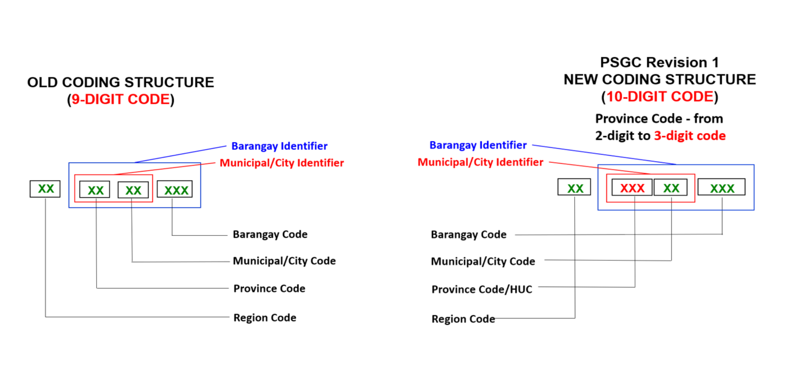

<p align="center">
  <a href="LICENCE" >
    
  </a>
  <a href="https://www.npmjs.com/package/@aivangogh/ph-address">
    
  </a>
  <a href="https://www.npmjs.com/package/@aivangogh/ph-address">
    
  </a>
</p>

# PH-Address

A lightweight Philippine address-data package containing the official [Philippine Standard Geographic Code (PSGC)](https://psa.gov.ph/classification/psgc/) geographic hierarchy as of 30 June 2026 and separate postal-code mappings.

[Explore the Philippine address data](https://aivangogh.dev/tools/ph-address)

## Features

- **Address Data**: PSGC regions, provinces, municipalities, cities, and barangays, plus Philippine postal-code mappings.
- **Ultra-Lightweight**: Highly optimized bundle size (~373 KB dist) using CSV + gzip compression — 40% smaller than the previous format.
- **Fast Performance**: Efficient data loading with automatic caching. Barangay data (42k rows) decompresses and parses in ~39 ms on first call; subsequent calls are nearly instant.
- **Fully Typed**: Written in TypeScript for a better developer experience with full type definitions.
- **Easy to Use**: A simple and intuitive API for retrieving regions, provinces, municipalities, and barangays.
- **Zero Configuration**: Works out of the box in both Node.js and browser environments.

## Node.js and Browser Support

This package supports Node.js 18 or newer and browsers, with both CommonJS (`require()`) and ESM (`import`) syntax. The data is bundled directly with the code using efficient compression, so it works seamlessly without needing file system access.

## Address Data Model

### PSGC geographic codes



PSGC Revision 1 uses a 10-digit `RR-PPP-MM-BBB` structure:

| Segment | Meaning                                 |
| ------- | --------------------------------------- |
| `RR`    | Region                                  |
| `PPP`   | Province or highly urbanized city (HUC) |
| `MM`    | Municipality or city                    |
| `BBB`   | Barangay                                |

### Postal codes

Philippine postal codes are separate four-digit delivery-area identifiers. They complement PSGC codes but are not derived from them: a municipality can have multiple postal codes, and a postal code can cover multiple localities.

### Performance Characteristics

- **Bundle Size**: ~373 KB (dist/index.mjs) — 40% smaller than the previous format
- **Initialization**: ~39 ms for barangays on first call (decompresses and caches all data)
- **Subsequent Calls**: < 1ms (data is cached in memory)

The package uses CSV with gzip compression for optimal size and parse speed. Data is automatically decompressed on first use and cached for instant access on subsequent calls.

### Format Benchmark

Benchmarked on 42,010 barangay rows (20 iterations median):

| Format                      | Compressed size | Decompress + parse |
| --------------------------- | --------------- | ------------------ |
| JSON                        | 586 KB          | 81 ms              |
| CSV full                    | 477 KB          | 77 ms              |
| **CSV optimized** (current) | **346 KB**      | **39 ms**          |

CSV optimized removes columns that are derivable from the 10-digit PSGC code structure, then derives them at load time — smaller payload and less to parse.

## Versioning

This package uses a calendar-based versioning scheme: `YYYY.Q.P`

- `YYYY`: The year of the PSGC data publication.
- `Q`: The quarter of the publication (1, 2, 3, or 4).
- `P`: A patch number for any bug fixes or improvements to the package itself, which resets with each new quarterly release.

For example, version `2025.3.1` means the data is from the **3rd quarter of 2025**, with `1` patch release.

## Installation

```bash
# Using npm
npm install @aivangogh/ph-address

# Using yarn
yarn add @aivangogh/ph-address

# Using pnpm
pnpm add @aivangogh/ph-address
```

## API Reference

You can import all functions from the package:

```ts
import {
  getAllRegions,
  getRegionByCode,
  getAllProvinces,
  getProvinceByCode,
  getAllMunicipalities,
  getMunicipalityByCode,
  getAllBarangays,
  getBarangayByCode,
  getProvincesByRegion,
  getMunicipalitiesByProvince,
  getBarangaysByMunicipality,
  getAddressByBarangayCode,
  getAllPostalCodes,
  getLocationsByPostalCode,
  getPostalCodesByMunicipality,
} from "@aivangogh/ph-address";
```

### Function signatures

| Function                                                 | Return type                   |
| -------------------------------------------------------- | ----------------------------- |
| `getAllRegions()`                                        | `readonly PHRegion[]`         |
| `getRegionByCode(code: string)`                          | `PHRegion \| undefined`       |
| `getAllProvinces()`                                      | `readonly PHProvince[]`       |
| `getProvinceByCode(code: string)`                        | `PHProvince \| undefined`     |
| `getProvincesByRegion(code: string)`                     | `readonly PHProvince[]`       |
| `getAllMunicipalities()`                                 | `readonly PHMunicipality[]`   |
| `getMunicipalityByCode(code: string)`                    | `PHMunicipality \| undefined` |
| `getMunicipalitiesByProvince(code: string)`              | `readonly PHMunicipality[]`   |
| `getAllBarangays()`                                      | `readonly PHBarangay[]`       |
| `getBarangayByCode(code: string)`                        | `PHBarangay \| undefined`     |
| `getBarangaysByMunicipality(code: string)`               | `readonly PHBarangay[]`       |
| `getAddressByBarangayCode(code: string)`                 | `PHAddress \| undefined`      |
| `getAllPostalCodes()`                                    | `readonly PHPostalCode[]`     |
| `getLocationsByPostalCode(postalCode: string)`           | `readonly PHPostalCode[]`     |
| `getPostalCodesByMunicipality(municipalityCode: string)` | `readonly PHPostalCode[]`     |

Collection lookups return an empty readonly array when no records match;
exact-code lookups return `undefined`.

---

### Code and Address Lookup

```ts
getBarangayByCode(code: string): PHBarangay | undefined;
getAddressByBarangayCode(code: string): PHAddress | undefined;
```

```ts
const barangay = getBarangayByCode("0730600001");
const address = getAddressByBarangayCode("0730600001");
```

Exact lookups return `undefined` for unknown codes. `address.province` is
optional for NCR and independent or highly urbanized cities.

---

### `getAllRegions()`

Returns `readonly PHRegion[]`, sorted by region order.

**Example:**

```ts
import { getAllRegions } from "@aivangogh/ph-address";

const regions = getAllRegions();
console.log(regions);
/*
[
  { name: 'AUTONOMOUS REGION IN MUSLIM MINDANAO (ARMM)', psgcCode: '1900000000', designation: 'ARMM' },
  { name: 'BICOL REGION', psgcCode: '0500000000', designation: 'REGION V' },
  ...
]
*/
```

---

### `getAllProvinces()`

Returns `readonly PHProvince[]`, sorted alphabetically.

**Example:**

```ts
import { getAllProvinces } from "@aivangogh/ph-address";

const provinces = getAllProvinces();
console.log(provinces);
/*
[
  { name: 'Abra', psgcCode: '1400100000', regionCode: '1400000000' },
  { name: 'Agusan Del Norte', psgcCode: '1600200000', regionCode: '1600000000' },
  ...
]
*/
```

---

### `getProvincesByRegion(regionCode)`

Returns `readonly PHProvince[]`, sorted alphabetically. Returns an empty array
when the region has no matching provinces.

- `regionCode` (string): The PSGC code of the region.

**Example:**

```ts
import { getProvincesByRegion } from "@aivangogh/ph-address";

// Get all provinces in Region VII (Central Visayas)
const provinces = getProvincesByRegion("0700000000");
console.log(provinces);
/*
[
  { name: 'Bohol', psgcCode: '0701200000', regionCode: '0700000000' },
  { name: 'Cebu', psgcCode: '0702200000', regionCode: '0700000000' }
]
*/
```

---

### `getMunicipalitiesByProvince(provinceCode)`

Returns `readonly PHMunicipality[]`, sorted alphabetically. Returns an empty
array when the province has no matching municipalities or cities.

- `provinceCode` (string): The PSGC code of the province.

**Example:**

```ts
import { getMunicipalitiesByProvince } from "@aivangogh/ph-address";

// Get all municipalities in Cebu
const municipalities = getMunicipalitiesByProvince("0702200000");
console.log(municipalities);
/*
[
  { name: 'Alcantara', psgcCode: '0702201000', provinceCode: '0702200000' },
  { name: 'Alcoy', psgcCode: '0702202000', provinceCode: '0702200000' },
  ...
]
*/
```

---

### `getBarangaysByMunicipality(municipalityCode)`

Returns `readonly PHBarangay[]`, sorted alphabetically. Returns an empty array
when the municipality or city has no matching barangays.

- `municipalityCode` (string): The PSGC code of the municipality or city.

**Note**: In the context of this library and the PSGC data, the term "municipality" is used to refer to both municipalities and cities.

**Example:**

```ts
import { getBarangaysByMunicipality } from "@aivangogh/ph-address";

// Get all barangays in Cebu City
const barangays = getBarangaysByMunicipality("0730600000");
console.log(barangays);
/*
[
  { name: 'Adlaon', psgcCode: '0730600001', municipalCityCode: '0730600000' },
  { name: 'Agsungot', psgcCode: '0730600002', municipalCityCode: '0730600000' },
  ...
]
*/
```

## Postal Codes

Postal codes are separate from the PSGC hierarchy because one municipality can
have multiple delivery localities and codes.

```ts
getAllPostalCodes(): readonly PHPostalCode[];
getLocationsByPostalCode(postalCode: string): readonly PHPostalCode[];
getPostalCodesByMunicipality(
  municipalityCode: string,
): readonly PHPostalCode[];
```

Postal-code lookups return an empty readonly array when no records match.

```ts
import {
  getAllPostalCodes,
  getLocationsByPostalCode,
  getPostalCodesByMunicipality,
} from "@aivangogh/ph-address";

getLocationsByPostalCode("6000");
getPostalCodesByMunicipality("0730600000"); // Cebu City
getAllPostalCodes();
```

Every current PSGC municipality/city has at least one postal-code mapping.
Historical names and spelling differences are resolved through reviewed
aliases. New BARMM Special Geographic Area municipalities use the PHLPost
codes inherited from the municipalities that previously contained their
barangays. GeoNames localities that still cannot be identified safely remain
available through postal-code lookup without a `municipalityCode`.

## Types

You can import all the necessary types for use in your TypeScript projects.

```ts
import type {
  PHRegion,
  PHProvince,
  PHMunicipality,
  PHBarangay,
  PHPostalCode,
  PHAddress,
} from "@aivangogh/ph-address";
```

```ts
type PHRegion = {
  name: string;
  psgcCode: string;
  designation: string;
};

type PHProvince = {
  name: string;
  psgcCode: string;
  regionCode: string;
};

type PHMunicipality = {
  name: string;
  psgcCode: string;
  provinceCode: string;
};

type PHBarangay = {
  name: string;
  psgcCode: string;
  municipalCityCode: string;
};

type PHPostalCode = {
  postalCode: string;
  placeName: string;
  provinceName: string;
  regionName: string;
  municipalityCode?: string;
};

type PHAddress = {
  region: PHRegion;
  province?: PHProvince;
  municipality: PHMunicipality;
  barangay: PHBarangay;
};
```

`PHAddress.province` is optional for NCR and independent or highly urbanized
cities. `PHPostalCode.municipalityCode` is optional when a delivery locality
cannot be mapped safely to a current PSGC municipality or city.

## Data Source

Geographic data is sourced from the quarterly publications of the **Philippine Statistics Authority (PSA)**.

Postal-code data is from [GeoNames](https://www.geonames.org/), licensed under
[CC BY 4.0](https://creativecommons.org/licenses/by/4.0/). The source snapshot
and its readme are stored in `assets/ph-postal-code`. Reviewed mappings use the
[PHLPost ZIP Code Locator](https://phlpost.gov.ph/zip-code-locator/) and the
PSA PSGC correspondence data bundled with this package.

## License

[MIT](LICENCE)
